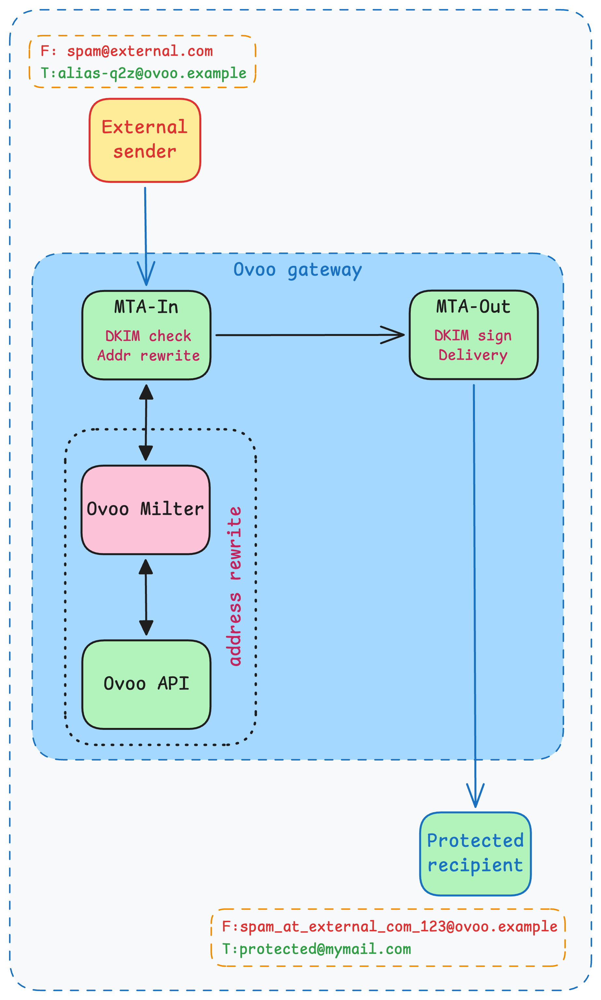

# Ovoo — Anonymous Email Aliasing & Forwarding

Ovoo is your personal email privacy guardian that you can host yourself, which can helps you to hide your real email address. Imagine creating unlimited unique email addresses that all forward to your real inbox - without ever revealing your actual email address to anyone. Just like premium email privacy services, but completely under your control.

Whether you're signing up for a newsletter, shopping online, or managing business communications, Ovoo lets you create disposable or permanent email aliases that protect your privacy while ensuring you never miss an important message.

## Overview

Ovoo works with two simple concepts:
* `Protected address` - Your real email address where you want to receive messages
* `Alias` - A randomly generated email address that forwards messages to your protected address. Even when you reply, your real email stays hidden

Setting up Ovoo is straightforward - you just need one server running the Ovoo software and an email server (MTA) to handle the actual email delivery (which can be on the same host).

You can find comprehensive setup guide for a single server in [docs/mail_setup](docs/mail_setup).

Related components:
* Chrome extension: [Ovoo Chrome Extension](https://github.com/Burmuley/ovoo-chrome-extension)

## Components

Ovoo has a simple architecture with just two main parts that run from the same program

### Ovoo API

This is the central brain of Ovoo, providing a REST API service built with Go. It allows you to:
* Create and manage your email aliases that forward to your real inbox
* Control user access through modern authentication methods like OpenID Connect (OIDC), API Keys, or simple username/password
* Use a friendly web interface built with Vue.js to manage everything

Want to integrate with other tools? Check out the full OpenAPI documentation in [openapi.yaml](./openapi.yaml).

#### REST API Overview

| Endpoints group         | Description                                                                  |
| ----------------------- | ---------------------------------------------------------------------------- |
| /api/v1/aliases         | Allows to manage `Alias` entities for all users                              |
| /api/v1/users           | Allows to manage `User`s of the system (only available to `admin` users)     |
| /api/v1/users/profile   | Retrieves the current authenticated user profile                             |
| /api/v1/users/apitokens | Provides ability to manage API keys for authentication                       |
| /api/v1/praddrs         | Allows managing `Protected address` entities for all users                   |
| /api/v1/domains         | Manage custom alias domains (personal domains for regular users, global domains for admins); includes DNS ownership verification |
| /api/v1/version         | Retrieve runtime version information (version, git commit, build timestamp)  |
| /private/api/v1/chains  | Manage email chains identifying each message flow (only used by Ovoo Milter) |

### Ovoo Milter

Ovoo Milter implements [Sendmail Milter](https://www.postfix.org/MILTER_README.html)
protocol and is aimed to use as filtering layer for any MTA supporting this protocol (for now it's only tested
with [Postfix](https://postfix.org))

Ovoo Milter is responsible for receiving emails from MTA and checking if the destination address belongs to the
Ovoo ecosystem, in other words if it can find an `Alias` in the database, it will rewrite incoming email headers to securely forward it to the matching `Protected Address`.

Here is simple diagram depicting the basic workflow:

<p align="center">
    
</p>


### Ovoo Socketmap

Ovoo Socketmap implements the [Postfix Socketmap protocol](https://www.postfix.org/socketmap_table.5.html), acting as a general-purpose bridge that supplies mail-routing information to Postfix on demand — relay domains, transport maps, access control data, or any other lookup Postfix can delegate via the Socketmap interface.

At various points in SMTP processing Postfix queries the socket with a lookup key; Ovoo Socketmap consults the Ovoo API and returns a standard response (`OK`, `NOTFOUND`, `TEMP`, or `PERM`). Currently the implemented lookup type is **relay-domain validation**: Postfix queries whether a destination domain is active and verified in Ovoo before deciding to accept a message for relay.

Ovoo Socketmap is started with:

```
ovoo socketmap -config <path>
```

It listens on a configurable Unix domain socket (default: `/tmp/ovoo_socketmap.sock`).

## Roadmap

- [x] REST API and core mail flow logic
- [x] Milter and integration with Postfix
- [x] WebUI for simple access
- [x] Multiple domain support
- [x] [Ovoo Chrome Extension](https://github.com/Burmuley/ovoo-chrome-extension)
- [ ] NoSQL databases support
- [ ] Safari browser plugin
- [ ] IaC for easy deployments to: GCP, AWS, VPS
